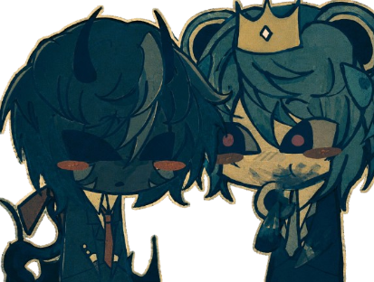
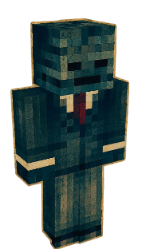
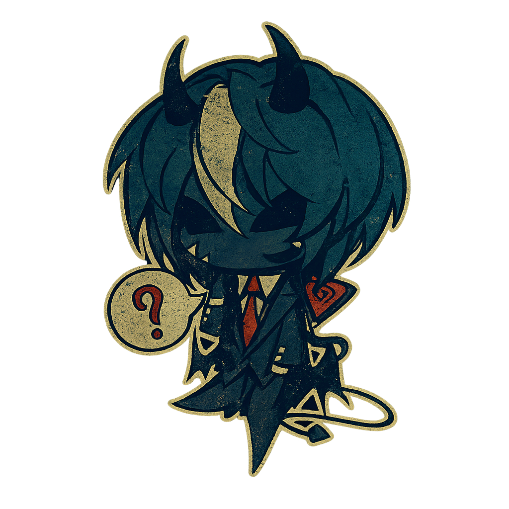

<table>
  <tr>
    <td>
       

  

 
</h1>

</h1>

 <h1 align="center">
<h1 align="center">
<h1 align="center">
 <h1 align="center">
  
</h1>

 
<h1>
    </td> 

<v></v>
    <td>
       
  
 

  

    

    </td>
  </tr>
</table>
